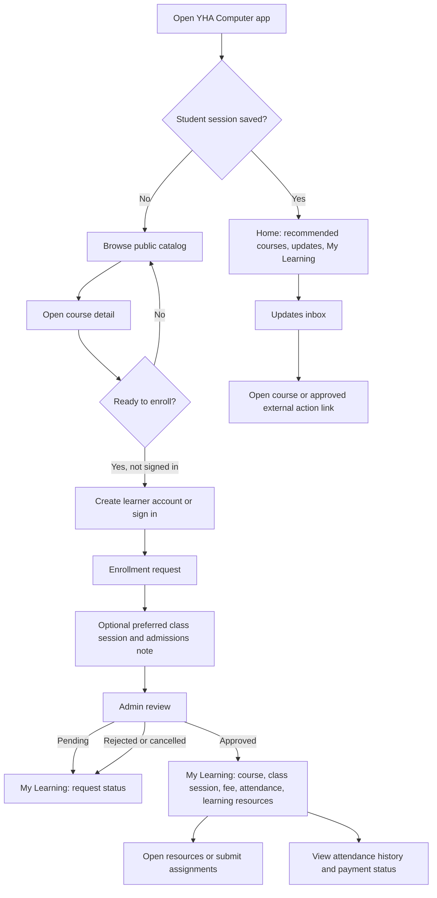

# YHA Computer Flutter Learner App: Action Flow and Android Build Guide

## Purpose and scope

The Flutter application is the **learner-facing YHA Computer app**. It does not contain teacher or administrator operations. Teachers use the protected web teacher portal; administrators use the protected web dashboard. This separation keeps the mobile navigation simple, prevents accidental use of privileged functions on a learner device, and keeps role authorization on the server.

The app reads and writes operational data exclusively through the YHA Turso-backed API. It does not use Firebase for course data or notifications.

## Learner action flow



## Core learner journeys

| Journey | Student actions | Server-side result | Clear feedback in app |
|---|---|---|---|
| Browse courses | Home → Learn → search/filter → open card | Reads published Turso courses only | Skeleton/loading, empty states, retry actions |
| Register | More → Account → Register | Creates a pending learner account and, when a course was selected, a pending enrollment request | Shows the Student ID returned by the API and explains that administrator approval is required |
| Sign in | More → Account → Student ID + password | Creates a signed learner session saved in secure storage | Returns to the learner area; session is restored on next app launch |
| Enroll in course | Course detail → Enroll now → preferred session/note → Send request | Creates a duplicate-safe `pending` enrollment | Snackbar confirmation and visible pending status in My Learning |
| Track approval | More → My Learning | Reads student profile and enrollment records | Shows pending, approved, rejected, cancelled, or completed state plus admin notes |
| Study | My Learning → resources / assignments | Reads resources and assignments only for approved/completed enrollments | Empty state when no learning material is published |
| Submit assignment | My Learning → Assignments → Submit/Update | Creates or updates one submission per assignment/student | Shows “submitted for teacher review”; graded score and feedback appear after teacher review |
| Check attendance | My Learning → Attendance → History | Reads attendance records belonging to the signed learner | Shows present, late, absent, and note records; corrections are requested through YHA staff |
| Receive updates | Updates tab → open notification | Reads Turso notification feed and stores device-local seen/read status | Marks item read; opens related in-app course or an HTTPS action URL safely |
| Get account help | Account → Password help | Creates a privacy-safe admin help request | Shows neutral success feedback without exposing account existence |

## Student profile data

Required registration data is intentionally short: **full name, email, phone, and password**. A learner may optionally expand the profile section to provide Viber phone, city, township, birthday, gender, and education. Optional fields help YHA admissions staff but do not block sign-up.

Personal identity values such as NRC, guardian details, and credentials are not required in the Flutter signup flow. If YHA needs them for a specific enrollment, staff should request them only through an approved operational process. Password hashes and signed session secrets are never exposed to the client.

## Operational role boundaries

| Role | Device and surface | May do | Must not do |
|---|---|---|---|
| Learner | Flutter app and learner web pages | Browse, register, request enrollment, view own learning data, submit own work | View other learners, approve payments/enrollments, mark attendance, or create staff notices |
| Teacher | `/teacher` web portal | Work only with assigned courses, mark roster attendance, publish assignments, grade submissions | Access another teacher’s course data, edit fees, or manage student credentials |
| Admin | `/admin` web portal | Create/assign teachers, approve enrollment, manage sessions/payments, publish notices, resolve account requests | Receive or write raw learner/teacher password hashes |

## Notification behavior

The app has an Updates inbox and Android best-effort background synchronization using WorkManager. When a signed-in learner has network access, the app reads scheduled Turso notifications. The first successful sync establishes a baseline so historical notices are not displayed as fresh device alerts. Urgent and high-priority labels remain visible in the inbox.

A notice can point to a course or include an HTTPS action URL. Course-related actions are opened inside the app. HTTPS actions are opened through the device browser. Unsupported or malformed links show a safe error message rather than executing arbitrary schemes.

## Android release preparation

The current project is configured for Android API/Flutter defaults, Internet access, Android 13 notification permission, and boot completion needed for the background notification worker. The remaining release work is application identity, app display name, launcher assets, versioning, and signing.

### Release checklist

| Item | Required action |
|---|---|
| Stable application ID | Use `tech.yhaedu.student` consistently in Gradle and `MainActivity`; once the app is uploaded to Play, do not change it for future updates. |
| App label | Set the Android label to `YHA Computer` so users do not see the development package name. |
| Version | Start this release at `1.0.0+1`; increment the build number for every Play upload. |
| Launcher icon | Replace default Flutter launcher art with an approved YHA Computer 512×512 source before store release. |
| API endpoint | Confirm production API base URL is `https://www.yha-edu.tech` before creating the release artifact. |
| Release signing | Generate an upload keystore, keep it outside Git, create private `android/key.properties`, then build a signed AAB. |
| Android verification | Run analyzer, unit tests, debug APK, and a signed release AAB on an actual Android device. |
| Play Console | Upload the signed AAB to internal testing first, then test enrollment, class approval, notifications, resources, and assignment submission with non-production student accounts. |

## Build instructions

Run these commands on a machine with a supported Flutter SDK, Android SDK, and Java 17 installed.

```bash
cd yhacomputer_flutter
flutter doctor -v
flutter pub get
flutter analyze
flutter test
flutter build apk --debug
```

The debug APK is generated at:

```text
build/app/outputs/flutter-apk/app-debug.apk
```

Install it onto a connected Android phone with:

```bash
flutter install
```

### Generate an upload key once

Do this once on a secure administrator machine. Never commit the `.jks` file, passwords, or `android/key.properties` into Git.

```bash
keytool -genkey -v \
  -keystore "$HOME/yha-computer-upload.jks" \
  -storetype JKS \
  -keyalg RSA \
  -keysize 2048 \
  -validity 10000 \
  -alias yha-upload
```

Create the private file `android/key.properties` locally:

```properties
storePassword=YOUR_KEYSTORE_PASSWORD
keyPassword=YOUR_KEY_PASSWORD
keyAlias=yha-upload
storeFile=/absolute/path/to/yha-computer-upload.jks
```

After the signing configuration is present, create the Play Store artifact:

```bash
flutter clean
flutter pub get
flutter build appbundle --release
```

The Android App Bundle is generated at:

```text
build/app/outputs/bundle/release/app-release.aab
```

For direct distribution to a small testing group, build a signed APK instead:

```bash
flutter build apk --release
```

## Release test script

Before uploading an AAB, use two test learner accounts and one teacher/admin account to run the following scenario in order.

1. Install a clean debug APK; confirm browse/search, dark-navy/orange interface, and public course data load from the production API.
2. Register a learner with the app and retain the returned Student ID.
3. Open a course, request enrollment, select a preferred session when available, and verify the pending entry appears in My Learning.
4. Approve the request through the web Admin Dashboard and assign the class session.
5. Sign in again in Flutter; confirm course, session, fee, resources, and payment status appear.
6. Mark attendance and publish an assignment from the teacher web portal; verify student attendance history and assignment appear in Flutter.
7. Submit a learner assignment in Flutter; grade it in the teacher portal; refresh Flutter and confirm score/feedback appear.
8. Send a Turso-backed notification from the web dashboard; confirm the Updates inbox and course/external link action work.
9. Put the app in the Android background; allow the periodic worker and confirm an eligible new notice is shown as a local notification when the operating system permits background execution.

## Security and release notes

> Android release artifacts require a private signing key. Keep the upload key, its passwords, `key.properties`, Turso credentials, and Vercel session secrets outside Git. Android and Flutter documentation both state that Play uploads use an upload key and that private keystore material must not be committed. [1] [2]

The Play Store accepts Android App Bundles and uses Play App Signing to distribute device-specific APKs. Build an AAB for Play Console; use an APK only for direct device testing or other distribution channels. [1] [2]

## References

[1]: https://docs.flutter.dev/deployment/android "Flutter documentation: Build and release an Android app"
[2]: https://developer.android.com/studio/publish/app-signing "Android Developers: Sign your app"

## Validation result in this workspace

The release configuration was structurally validated in this workspace: the Android namespace and application ID are both `tech.yhaedu.student`; the Android label is `YHA Computer`; the moved `MainActivity` package matches the namespace; private signing configuration is loaded only from ignored `android/key.properties`; and `.jks` files are ignored by Git.

A real APK or AAB could not be generated in this sandbox because neither the Flutter SDK nor Dart CLI is installed, and the native Gradle wrapper executable is not present in the repository checkout. No build artifact has been fabricated. Run the commands in **Build instructions** on a Flutter/Android development machine to create and test the actual APK/AAB.
